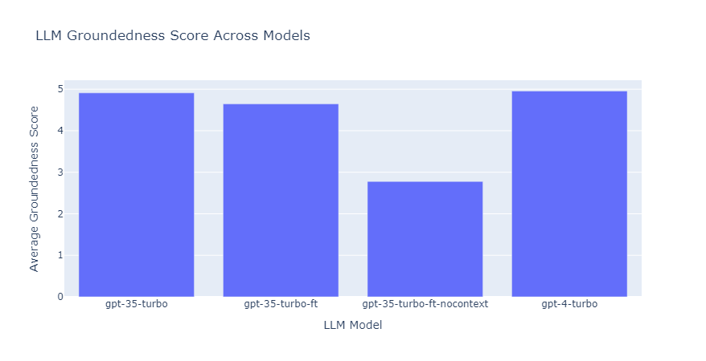

# llmrageval


In this project, we will demonstrate how different OpenAI models perform that uses Retrieval based methods. We will use the following models:
- GPT-4-Turbo (1106) 
- GPT-35-Turbo (1106)
- GPT-35-Turbo (1106) Fine Tuned


[Promptflow](https://learn.microsoft.com/en-us/azure/ai-studio/how-to/flow-bulk-test-evaluation) Evaluation is used to evaluate the models. This uses [LLM-as-a-Judge](https://arxiv.org/pdf/2306.05685.pdf) approach to evaluate the models.

## Prompt Engineering

The below prompt is used to retrieve the responses from the models.
Here a [sample pdf document](./rag_eval_notebooks/data/azure-machine-learning-azureml-api-2.pdf) is chunked and vectorized and stored in local Chroma database. text-embedding-ada-002 model is used to vectorize the documents. 


#### RAG with Few Shot Examples

```markdown
    instruction = """
        You only provide factual answers to queries, and do not provide answers that are not related to Azure Machine Learning.
        Answer based on the context provided to you. If you cannot answer based on the context, say that you cannot answer this question.
        """
    systemPromptTemplate = """
            You are a machine learning expert agent whose primary goal is to help users with questions with Azure Machine Learning. 
            {instruction}
            """
        userMessage = f""" 
        <Context>
        {docs}
        </Context>

        <Few_Shot_Examples>
        {
        "question": "How can you authenticate to Azure ML workspace using the Azure CLI?",
        "answer": "You can authenticate to an Azure ML workspace using the Azure CLI by first logging in using `az login`, then setting your subscription with `az account set --subscription <your-subscription-id>`. Finally, use the Azure ML extension with `az ml workspace show --name <workspace-name> --resource-group <resource-group>` to access the workspace."
        },
        {
        "question": "What is the purpose of the `Environment` class in AML SDK v2?",
        "answer": "The `Environment` class in AML SDK v2 is used to define a reproducible Python environment for experiments. It specifies the Python packages, environment variables, and Docker settings needed to run your training scripts. Environments ensure that your experiments are consistent across different compute targets."
        },
        {
        "question": "How do you scale out model training to multiple nodes using Azure ML?",
        "answer": "To scale out model training to multiple nodes in Azure ML, you can use Azure ML compute clusters. Define a `AmlCompute` cluster with multiple nodes as your compute target, and submit your training job to this cluster. Azure ML takes care of distributing the job across the nodes."
        }
        </Few_Shot_Examples>
        

        UserQuery: {userQuery}
        """
```


#### Retrieval with Fine Tuned Model

Here context is not sent to the model. The model is fine tuned on the dataset and the examples are part of the training dataset. 


```markdown
    instruction = """
        You only provide factual answers to queries, and do not provide answers that are not related to Azure Machine Learning.
        Answer based on the context provided to you. If you cannot answer based on the context, say that you cannot answer this question.
        """
    systemPromptTemplate = """
            You are a machine learning expert agent whose primary goal is to help users with questions with Azure Machine Learning. 
            {instruction}
            """
        userMessage = f""" 
        UserQuery: {userQuery}
        """
```

#### RAG with Zero Shot Examples

This can be used for retrieval with Finetuned models as well. Since the examples are already part of the training dataset. 

```markdown
    instruction = """
        You only provide factual answers to queries, and do not provide answers that are not related to Azure Machine Learning.
        Answer based on the context provided to you. If you cannot answer based on the context, say that you cannot answer this question.
        """
    systemPromptTemplate = """
            You are a machine learning expert agent whose primary goal is to help users with questions with Azure Machine Learning. 
            {instruction}
            """
        userMessage = f""" 
        <Context>
        {docs}
        </Context>      
        

        UserQuery: {userQuery}
        """
```

## Model Performance using Groundedness Score



For this dataset, GPT-4-Turbo (1106) model has the highest groundedness score of 5. This means that the model is able to provide the most grounded responses to the queries. The GPT-35-Turbo (1106) model has a groundedness score of 4.8 and the GPT-35-Turbo (1106) Fine Tuned model has a groundedness score of 4.5 and GPT-35-Turbo (1106) Fine Tuned model with no context has a groundedness score of 2.9.

This shows that the fine tuned models when augmented with the RAG context are able to provide grounded responses to the queries that are as good as GPT-4 responses from a groundedness perspective.


* Note: The Groundedness scores could vary based on the context, the queries and the dataset used for evaluation. 

